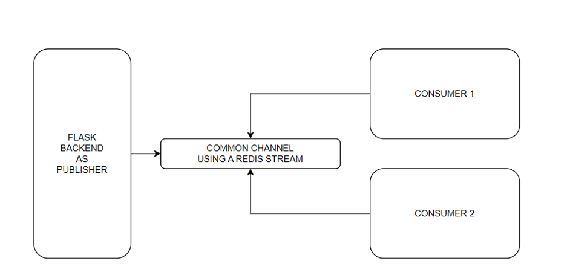

# Event Driven System using Redis Stream
## Introduction
This is a simple example of an event-driven system using Redis Stream. The system is composed of two services: `producer` and `consumer`. The `producer` service is responsible for producing events and sending them to the Redis Stream. The `consumer` service is responsible for consuming events from the Redis Stream and processing them.

## Architecture
The architecture of the system is shown in the diagram below:


## Running the System
To run the system, you need to have Docker and Docker Compose installed on your machine. Then, you can run the following command:
```bash
# start redis and publisher
docker-compose up -d redis publisher --build

# start consumers
docker-compose up -d consumer1 consumer2 --build

# Request the producer to produce events
# User registere event
curl -X POST -H "Content-Type: application/json" -d '{"event_type": "user_registered", "data": {"user_id": "admin123", "name": "Admin"}}' http://localhost:5000/create-event

# Order placed event
curl -X POST -H "Content-Type: application/json" -d '{"event_type": "order_placed", "data": {"order_id": 123, "product": "Product ABC"}}' http://localhost:5000/create-event
curl -X POST -H "Content-Type: application/json" -d '{"event_type": "order_placed", "data": {"order_id": 987, "product": "Product XYZ"}}' http://localhost:5000/create-event

# Check the logs of the consumers
docker-compose logs -f consumer1 consumer2
```

## Conclusion
This is a simple example of an event-driven system using Redis Stream. The system is composed of two services: `producer` and `consumer`. The `producer` service is responsible for producing events and sending them to the Redis Stream. The `consumer` service is responsible for consuming events from the Redis Stream and processing them. The system is scalable and fault-tolerant. It can handle a large number of events and can recover from failures.